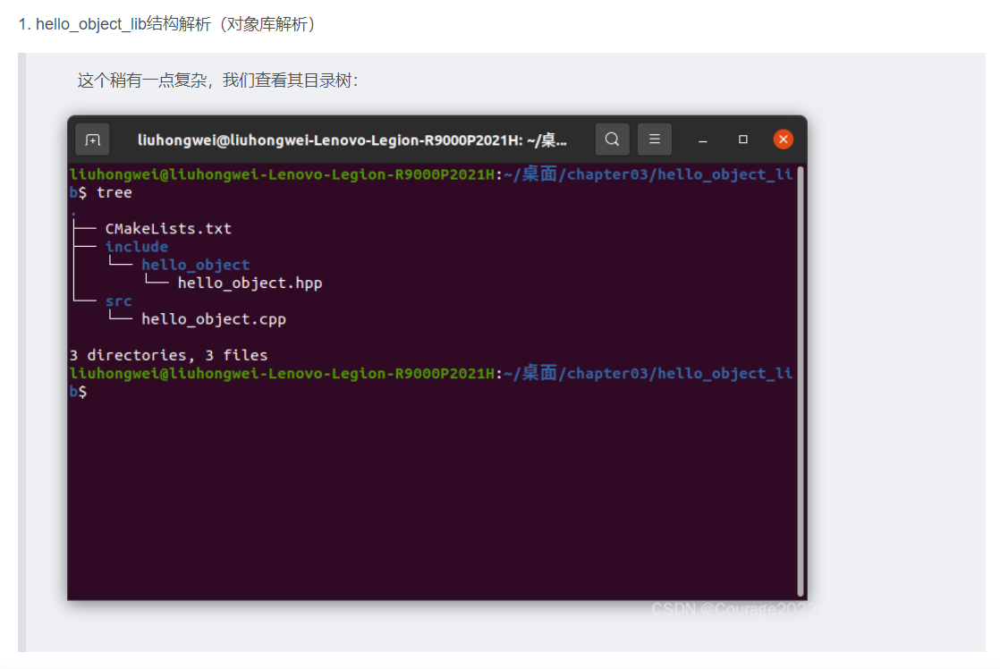

- [getting started](#getting-started)
  - [make CMakeLists](#make-cmakelists)
    - [常用预定义变量](#常用预定义变量)
    - [第一个CMakeLists.txt文件](#第一个cmakeliststxt文件)
    - [工程里有其他的头文件](#工程里有其他的头文件)
    - [工程里包含静态库](#工程里包含静态库)
    - [工程里包含共享库](#工程里包含共享库)
    - [工程里包含第三方库](#工程里包含第三方库)
  - [another example 用cmake构建对象库 (target_source)](#another-example-用cmake构建对象库-target_source)
    - [结构解析](#结构解析)
    - [库文件代码解读](#库文件代码解读)
    - [CMakLists.txt文件解读](#cmakliststxt文件解读)

# getting started


- src: used for c++ source files .cpp
- include: used for c++ header files .h
- tests: used for tests and related files

## make CMakeLists


### 常用预定义变量
```c++
// Variable	                 Info
CMAKE_SOURCE_DIR	        根源代码目录，工程顶层目录。暂认为就是PROJECT_SOURCE_DIR
CMAKE_CURRENT_SOURCE_DIR	当前处理的 CMakeLists.txt 所在的路径
PROJECT_SOURCE_DIR	        工程顶层目录
CMAKE_BINARY_DIR	        运行cmake的目录。外部构建时就是build目录
CMAKE_CURRENT_BINARY_DIR	The build directory you are currently in.当前所在build目录
PROJECT_BINARY_DIR	        暂认为就是CMAKE_BINARY_DIR
```

### 第一个CMakeLists.txt文件
文件树如下：
```c++
├── CMakeLists.txt
├── main.cpp
```
**CMakeLists.txt**文件如下：
```c++
cmake_minimum_required(VERSION 3.5) //设置CMake最小版本
project (hello_cmake) //设置工程名，自动生成一些变量，比如PROJECT_NAME
add_executable(hello_cmake main.cpp) //生成可执行文件
```
- CMake 命令不区分大小写。习惯上，CMake 命令全小写，预定义变量全大写。
- command(parameter1 parameter2 …)，参数使用括号括起，参数之间使用空格或分号分开。

### 工程里有其他的头文件
文件树如下：
```c++
├── CMakeLists.txt
├── include
│   └── Hello.h
└── src
    ├── Hello.cpp
    └── main.cpp
```
**CMakeLists.txt** 文件如下：
```c++
cmake_minimum_required(VERSION 3.5)//最低CMake版本
project (hello_headers)// 工程名
add_executable(hello_headers src/Hello.cpp //用所有的源文件生成一个可执行文件
						   src/main.cpp )//不建议对源文件使用变量
target_include_directories(hello_headers//设置这个可执行文件hello_headers需要包含的库的路径
    PRIVATE 
        ${PROJECT_SOURCE_DIR}/include
)
//PROJECT_SOURCE_DIR指工程顶层目录
//PRIVATE指定了库的范围
```
### 工程里包含静态库
文件树如下：
```c++
├── CMakeLists.txt
├── include
│   └── static
│       └── Hello.h
└── src
    ├── Hello.cpp
    └── main.cpp
```
main.cpp
```c++
#include "static/Hello.h" // 这里需要注意

int main(int argc, char *argv[])
{
    Hello hi;
    hi.print();
    return 0;
}
```
**CMakeLists.txt** 文件如下
```c++
cmake_minimum_required(VERSION 3.5)
project(hello_library)

//Create a library
//库的源文件Hello.cpp生成静态库libhello_library.a
add_library(hello_library STATIC 
    src/Hello.cpp
)
target_include_directories(hello_library
    PUBLIC 
        ${PROJECT_SOURCE_DIR}/include
)
//target_include_directories为一个目标（可能是一个库library也可能是可执行文件）添加头文件路径。

//Create an executable
//指定用哪个源文件生成可执行文件
add_executable(hello_binary 
    src/main.cpp
)
//链接可执行文件和静态库
target_link_libraries(hello_binary
    PRIVATE 
        hello_library
)
//链接库和包含头文件都有关于scope这三个关键字的用法。
```

### 工程里包含共享库
文件树如下：
```c++
├── CMakeLists.txt
├── include
│   └── shared
│       └── Hello.h
└── src
    ├── Hello.cpp
    └── main.cpp
```
**CMakeLists.txt** 文件如下：
```c++
cmake_minimum_required(VERSION 3.5)
project(hello_library)

//Create a library

//根据Hello.cpp生成动态库libhello_library.so
add_library(hello_library SHARED 
    src/Hello.cpp
)
//给动态库hello_library起一个别的名字hello::library
add_library(hello::library ALIAS hello_library)
//为这个库目标，添加头文件路径，PUBLIC表示包含了这个库的目标也会包含这个路径
target_include_directories(hello_library
    PUBLIC 
        ${PROJECT_SOURCE_DIR}/include
)

//Create an executable

//根据main.cpp生成可执行文件
add_executable(hello_binary
    src/main.cpp
)
//链接库和可执行文件，使用的是这个库的别名。
target_link_libraries( hello_binary
    PRIVATE 
        hello::library
)
```

### 工程里包含第三方库
main.c 如下所示：
```c++
#include <iostream>
#include <boost/shared_ptr.hpp>
#include <boost/filesystem.hpp>
/*Boost库是为C++语言标准库提供扩展的一些C++程序库的总称，由Boost社区组织开发、
维护。Boost库可以与C++标准库完美共同工作，并且为其提供扩展功能。*/
int main(int argc, char *argv[])
{
 ...
 return 0;
}
```
**CMakeLists.txt** 文件如下：
```c++
cmake_minimum_required(VERSION 3.5)
project (third_party_include)
//find a boost install with the libraries filesystem and system
find_package(Boost 1.46.1 REQUIRED COMPONENTS filesystem system)
//check if boost was found
if(Boost_FOUND)
    message ("boost found")
else()
    message (FATAL_ERROR "Cannot find Boost")
endif()
//Add an executable
add_executable(third_party_include main.cpp)
//link against the boost libraries
target_link_libraries( third_party_include
    PRIVATE
        Boost::filesystem
)
```

如上所述，find_package（）函数将从 CMAKE_MODULE_PATH 中的文件夹列表中搜索 “FindXXX.cmake” 中的CMake模块。find_package 参数的确切格式取决于要查找的模块。这通常记录在 FindXXX.cmake 文件的顶部。

参数：
- Boost：库名称。这是用于查找模块文件 FindBoost.cmake 的一部分；
- 1.46.1：需要的boost库最低版本；
- REQUIRED：告诉模块这是必需的，如果找不到会报错；
- COMPONENTS：要查找的库列表。从后面的参数代表的库里找 boost。

## another example 用cmake构建对象库 (target_source)
### 结构解析

### 库文件代码解读
```c++
#pragma once
 
#include <string>
 
namespace hello_object {
/// 显式导出到 dll 中的示例类
class HelloObject {
public:
  HelloObject(const std::string &name) : name_{name} {}
 
  void greet() const;
 
private:
  const std::string name_;
};
} // namespace hello_object
```
  这里有一个类，一个类的默认构造函数，另一个是greet方法，我们在源文件看其实现
  ```c++
  #include <hello_object/hello_object.hpp>
 
#include <iostream>
 
namespace hello_object {
void HelloObject::greet() const {
  std::cout << "Hello " << name_ << " From an object library\n";
}
} // namespace hello_object
```
greet函数输出一行字。

### CMakLists.txt文件解读
```c++
# Chapter3-  Example illustrating how to create an object library
#
# SPDX-License-Identifier: MIT
 
cmake_minimum_required(VERSION 3.17)
 
project(
    ch3_hello_object
    VERSION 1.0.0
    DESCRIPTION
        "A simple C++ project to demonstrate creating executables and libraries in CMake"
    LANGUAGES CXX
)
 
# 添加库目标
add_library(ch3_hello_object OBJECT)
 
# 将源添加到库目标
target_sources(ch3_hello_object PRIVATE src/hello_object.cpp)
 
# 定义编译该库并使其对依赖者可见所需的 C++ 标准
target_compile_features(ch3_hello_object PUBLIC cxx_std_17)
 
# 设置包含目录
target_include_directories(
    ch3_hello_object
    PRIVATE src/hello
    PUBLIC include
)
```
add_library关键字：创立一个名叫ch3_hello_object的库，是一个对象库。

target_sources关键字：添加库的源文件；第一个参数是库的名称，第二个指明私有，第三个是库源文件的路径，这时，库文件和源文件链接起来了。

target_include_directories：设置库的包含目录，库下面有俩文件夹，源文件设置为私有，库文件设置为公共权限。