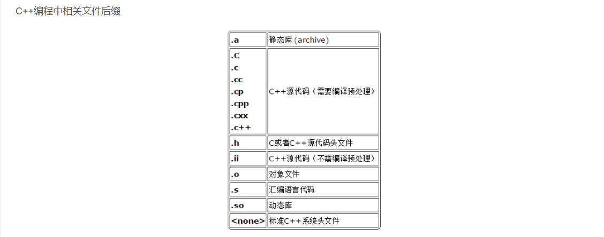

- [Animation Software Engineering](#animation-software-engineering)
- [What we will use](#what-we-will-use)
- [NCCA Graphics Library （ngl::）](#ncca-graphics-library-ngl)
- [CPP Core Guidelines](#cpp-core-guidelines)
- [helloWorld.cpp](#helloworldcpp)
  - [It's bad version](#its-bad-version)
  - [It's better](#its-better)
- [Compilation process](#compilation-process)
  - [compile](#compile)
  - [flag](#flag)
  - [clang++ vs g++](#clang-vs-g)
    - [GCC----GNU Compiler Collection](#gcc----gnu-compiler-collection)
    - [Clang](#clang)

# Animation Software Engineering
- Using C++ to develop Graphics application
- Develop 2D / 3D Applications and Tools
- Use OpenGL for Real-time applications
- Develop Algorithms for graphics simulations
- Output files to Renderman for High Quality production level graphics
- Write tools to help with the Graphics Production Pipeline

> you can wrap that up and have a Python binding for it so that you can use your **fast C++ code in Python**, sort of things like Numpy, CUDA and machine learing tools actually are all written in C++

# What we will use
- **C++** using the **clang++** compiler (and also g++) and other tools
- **Doxygen** for documenting our code
- **OpenGL**
- **QtCreator** IDE and Qt for GUI applications
- Loads of external libraries ( **OpenGL, Qt, Boost, Bullet**)
- **git** and **git-hub** for versions control and code submission

> Qt which is the standard GUI library within all the animation tools, virtually all of them use Qt as their sort of GUI and to extend it, that's written in **C++**, but there are bindings for other languages

# NCCA Graphics Library （ngl::）
https://nccastaff.bournemouth.ac.uk/jmacey/GraphicsLib/

# CPP Core Guidelines
http://isocpp.github.io/CppCoreGuidelines/CppCoreGuidelines


# helloWorld.cpp

## It's bad version

```c++
#include<iostream>
using namespace std;
int main(){
    count<<"Hello World"<<endl;
    return 0;
}
```


> - store in large memery, cuz pre processing
>
> - using namespace imports all of std
>
> - return 0 means: return是C++预定义的语句，它提供了终止函数执行的一种方式。当return语句提供了一个值时，这个值就成为函数的返回值.

## It's better

```c++
#include <iostream>
#include <cstdlib>
int main()
{
  std::cout<<"Hello World\n";
  return EXIT_SUCCESS;
}
```

> EXIT_SUCCESS, EXIT_FAILURE
> - Defined in header <cstdlib> - 定义于头文件 <cstdlib>
> - EXIT_SUCCESS 与 EXIT_FAILURE 展开成整数常量表达式能用做 std::exit 函数的参数 (从而能用做从 main 函数返回的值)，并指示程序执行状态。
> - use this because it's readable
> http://isocpp.github.io/CppCoreGuidelines/CppCoreGuidelines#a-namerio-endlasl50-avoid-endl


# Compilation process


## compile

When I compile g++ like this, it comes out a **a.out** file


- should add **-o** rename this file or all the default name is **a**
- a.out = assembler output
- 

编译器 g++ 通过检查命令行中指定的文件的后缀名可识别其为 C++ 源代码文件。编译器默认的动作：编译源代码文件生成**对象文件(object file)**，链接对象文件和libstdc++库中的函数得到可执行程序。然后删除对象文件。由于命令行中未指定可执行程序的文件名，编译器采用默认的 a.out。


- use **-o** to rename this file



- 程序 g++ 是将 gcc 默认语言设为 C++ 的一个特殊的版本，链接时它自动使用 C++ 标准库而不用 C 标准库。通过遵循源码的命名规范并指定对应库的名字，用 gcc 来编译链接 C++ 程序是可行的

## flag

- flags control the compiler functio
  - **-g** turn on debug information
  - **-Wall** enable all warnings
  - **-std=c++1z** turn on c++ 17 (use c++11 or c++14 for other versions)
  - **-o** output name (default if not used a.out)


## clang++ vs g++
### GCC----GNU Compiler Collection

> GUN编译器集合，包括gcc和g++编译器，它可以编译C、C++、JAV、Fortran、Pascal、Object-C、Ada等语言。

- gcc是GCC中的GUN C Compiler（C 编译器）
- g++是GCC中的GUN C++ Compiler（C++编译器）

> 是GNU项目的关键部分，亦是自由的类Unix及苹果电脑Mac OS X 操作系统的标准编译器。GCC（特别是其中的C语言编译器）也常被认为是跨平台编译器的事实标准。

gcc和g++的主要区别

- 对于 .c和.cpp文件，gcc分别当做c和cpp文件编译（c和cpp的语法强度是不一样的）

- 对于 .c和.cpp文件，g++则统一当做cpp文件编译

- 使用g++编译文件时，g++会自动链接标准库STL，而gcc不会自动链接STL

### Clang
一个C、C++、Objective-C和Objective-C++编程语言的**编译器前端**。包括Clang前端和Clang静态分析器等.它采用了**底层虚拟机（LLVM）作为其后端**，目标是提供一个GNU编译器套装（GCC）的替代品。苹果公司的赞助支持下进行开发，而源代码授权是使用类BSD的伊利诺伊大学厄巴纳-香槟分校开源码许可。兼容GCC，也是跨平台。

- It has the best error reporting and diagnostics of the two compilers