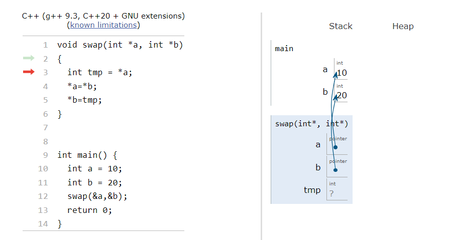
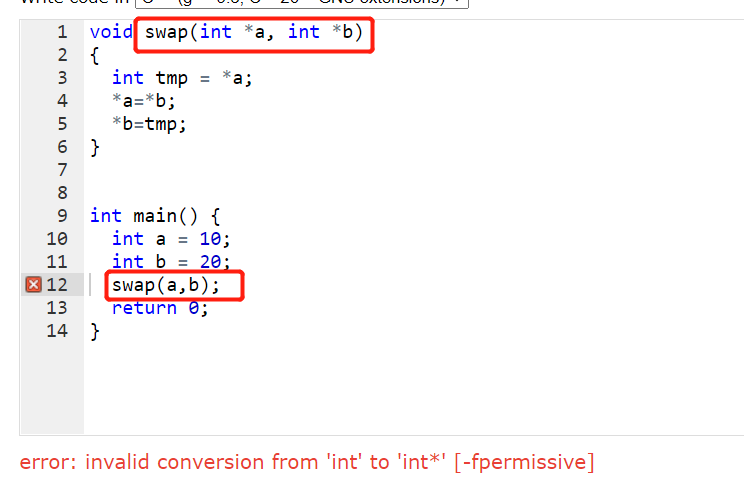
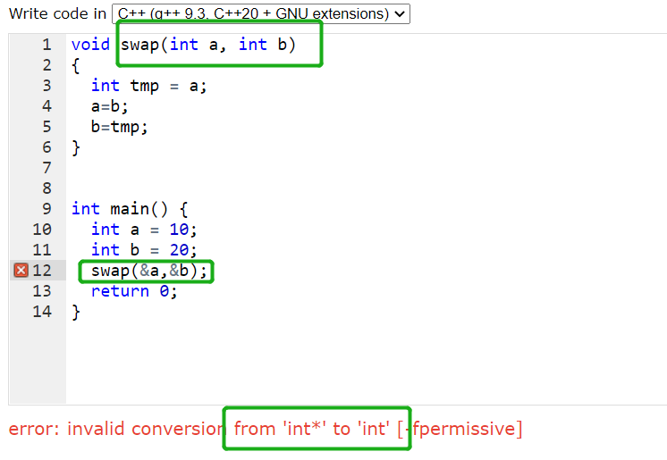
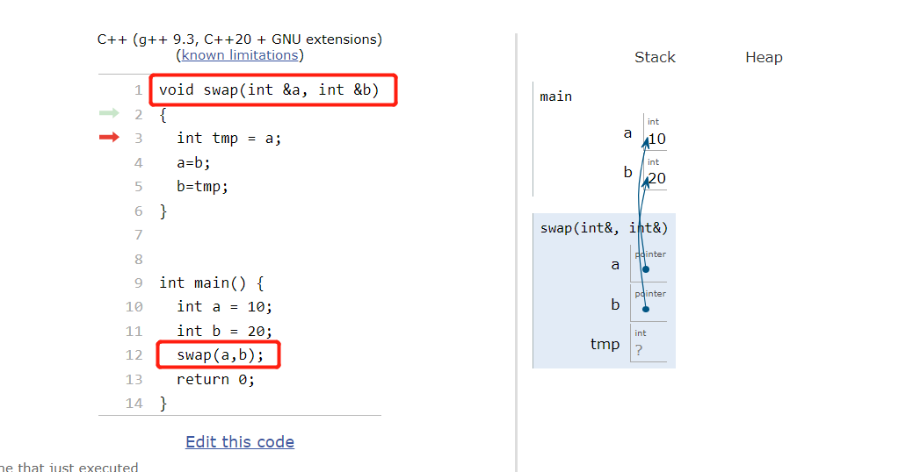
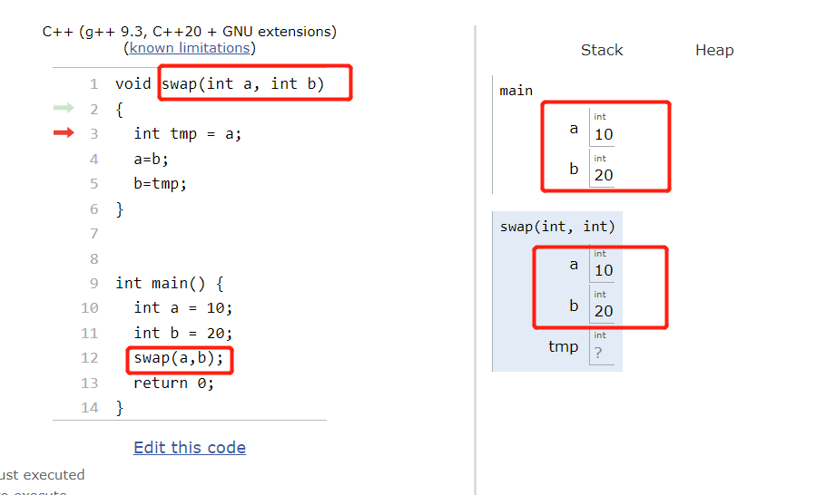
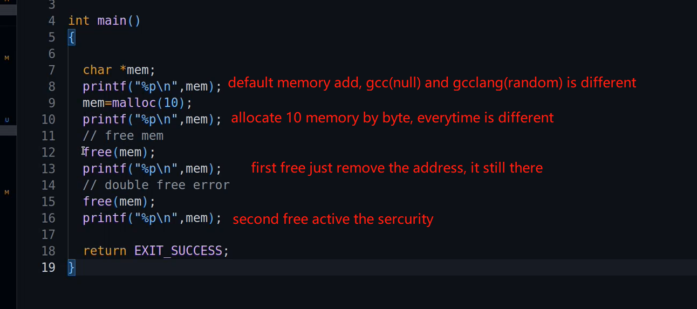
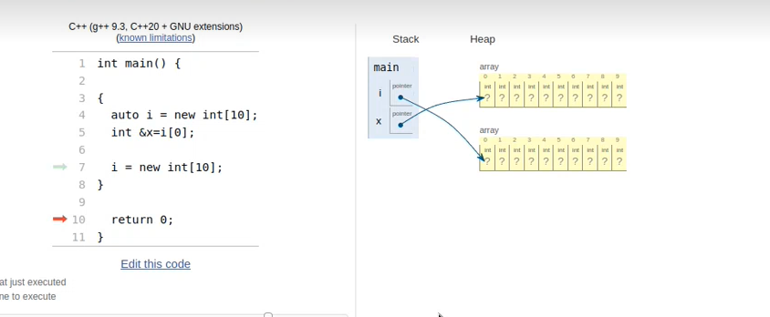
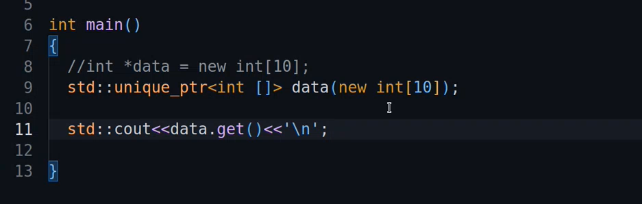
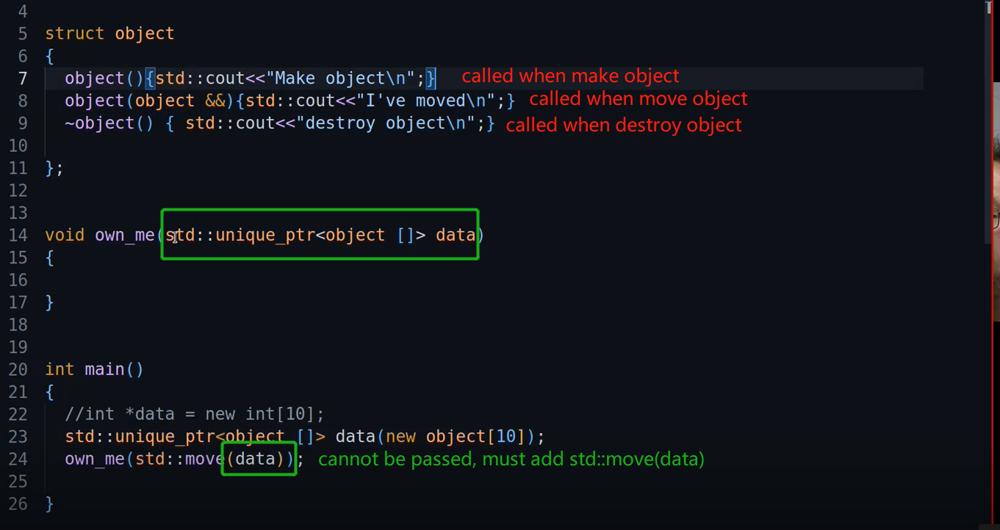

- [Storage Areas](#storage-areas)
- [core dump文件](#core-dump文件)
- [stack and heap](#stack-and-heap)
- [reference](#reference)
  - [& and C++](#-and-c)
- [Dynamic memory allocation](#dynamic-memory-allocation)
  - [realloc](#realloc)
- [C++ memory allocation](#c-memory-allocation)
  - [new and delete](#new-and-delete)
  - [smart pointers](#smart-pointers)
    - [std::unique_ptr<T>](#stdunique_ptrt)
    - [never write "new" and "delete" again](#never-write-new-and-delete-again)

# Storage Areas
When a program is executed three storage areas are created called segments.
- Text / Code Segment :- used for the machine code / program instructions including functions.
- Data Segment (Data + Block Started Symbol + Heap)
- The Stack Segment :- used for all variables / function variables executed in main

# core dump文件
core dump 又叫核心转储,是一个程序运行时的环境一个集合包，包含崩溃时的堆栈信息，是一个二进制文件，没法使用记事本打开，通常会在指定目录下生成一个core文件。core文件仅仅是一个内存映象，主要用来调试。

# stack and heap

# reference
> A reference is another name, alias, for an EXISTING object.There can't be NULL references. All references require initialization and the object which it refers to must be in existence.

```c++
int i=10;
int &iRef=i; //iRef is a reference for variable i. In other words an alias

i=11;  //since i now equals 11, iRef also equals 11
iRef=9; //now i equals 9
```

> Once a reference is initialized to refer to a particular object, it cannot later be made to refer to a difference object; a reference is bound to its initializer for its whole lifetime.
> Finally, a reference can not be initalized to a non-const literal or temporary value.

```c++
int &i=10; //error!
const int &idk=12; //ok
```

## & and C++






> In C++ the & is an explicit reference This means that the object passed using the & prefix is effectively a pointer but we are not using the * prefix as used in C
> In C++ *_a indicates that the value is a pointer and we may modify it in a function
> In C++ &_a is a reference (means we don’t copy the value) but still behaves like a pointer
> const &_a means that it is a constant reference to a value. This means it is copied like a pointer but is read only.

# Dynamic memory allocation
```c++
char *mem;
mem=malloc(1844634744071325);
free(mem);
```
> This allocates size bytes of memory.
> If the allocation succeeds, a pointer to the block of memory is returned.

```c++
#include <stdlib.h> 
void free(void *ptr);
```
> The pointer must be passed to free only once; unless malloc has been re-called on the same pointer.



## realloc
> The realloc function allows us to resize already allocated memory.
> We can shrink or grow this memory space

# C++ memory allocation
```c++
#include <cstdlib>
std::malloc()
std::free()
```

## new and delete
```c++
int *data = new int [100];
```
> Once we have finished with the memory allocated to the pointer we need remove it
> To do this we use the delete [] operation
> if we do not do this it could cause problems as we will see later



## smart pointers
```c++
#include <memory>
std::unique_ptr<T>
std::shared_ptr<T>
```

### std::unique_ptr<T>
```c++
std::unique_ptr<int  []> data ( new int [10]);
```
generate a new integer array of 10, basically generate a pointer, and copy that pointer into this "data"
> we can think unique pointer is a wraper, wrapping up that raw pointer that's returned from this into its own data.
> subpointer


that give me a memory address.



### never write "new" and "delete" again
https://scrupulousabstractions.tumblr.com/post/37576903218/cpp11style-no-new-delete 